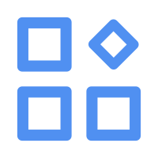

# WebNav - 个性化网页导航与工具集合

<p align="center">
  
</p>

<p align="center">
  <b>一个现代化、可定制的个人网页导航系统</b>
</p>

<p align="center">
  
  
  
  
</p>

## ✨ 特色功能

- 🔎 **多引擎搜索** — 支持Bing、Google、百度、Bilibili等多种搜索引擎快速切换
- 🎵 **内置音乐播放器** — 支持在线音乐搜索与播放，打造属于你的音乐氛围
- 🧩 **自定义网站卡片** — 添加、编辑、删除、拖拽排序你的网站收藏
- 🖼️ **动态美观背景** — 随机展示高清背景图，提升视觉体验
- ⏱️ **实时时钟显示** — 随时了解当前时间
- 👤 **用户系统** — 个性化配置保存与云同步
- 💨 **毛玻璃特效** — 现代UI设计，支持透明模糊效果

## 📷 预览图

> 请替换为实际项目截图

## 🛠️ 技术栈

- **前端框架**: Vue 3 + TypeScript
- **构建工具**: Vite
- **UI组件**: Element Plus
- **状态管理**: Pinia (带持久化存储)
- **路由**: Vue Router
- **动画效果**: Animate.css + Hover.css
- **HTTP请求**: Axios
- **特效**: v-wave 点击波纹 + 毛玻璃效果
- **拖拽功能**: Sortable.js

## 🚀 快速开始

### 安装依赖

```bash
npm install
```

### 开发模式

```bash
npm run dev
```

### 构建生产版本

```bash
npm run build
```

### 代码检查

```bash
npm run lint
```

## 💡 功能详解

### 多引擎搜索

支持在Bing、Google、百度、Bilibili等多种搜索引擎间无缝切换，只需滚动鼠标滚轮即可更改搜索引擎。

### 网站卡片管理

- **添加网站**: 点击添加按钮新增网站，自动获取网站图标和标题
- **编辑网站**: 支持修改网站名称、描述、图标和URL
- **删除网站**: 进入删除模式后可移除不需要的网站
- **拖拽排序**: 自由调整网站卡片顺序，方便而且流畅

### 音乐播放器

内置音乐搜索和播放功能，支持:
- 在线搜索音乐，可以听绝大多数歌曲，用的是网易云的api
- 音量控制(滚轮调节)
- 播放/暂停/上一曲/下一曲

### 用户系统

- 注册/登录功能
- 个人配置云端保存
- 多设备同步，最多支持10个设备登录同步

## 📝 待办功能

- 优化音乐卡片显示
- 增强拖拽体验
- 优化性能，加快加载速度
- 添加文件夹功能
- 兼容手机端，优化手机端体验

## 📜 许可证

MIT © 2025

## 🤝 贡献指南

欢迎提交问题和功能请求！随时提交PR或在issues中提出建议。

---

<p align="center">用❤️制作</p>